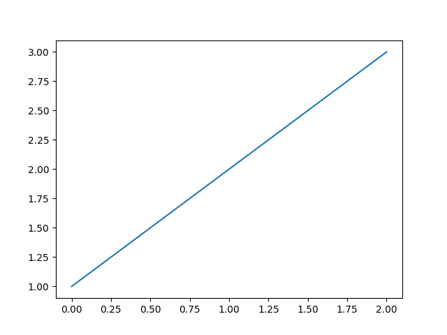

# DSCI 510: Principles of Programming
This is going to be an examle of the final project respoistyr fo rthe DSCI 510 class

# Dependencies
Good to have this here and as a requirements.txt file

# Installation

'''
pip install -r requirements.txt
'''

# Running the project

'''
python main.py
'''

# Methodology

# Visualizations

